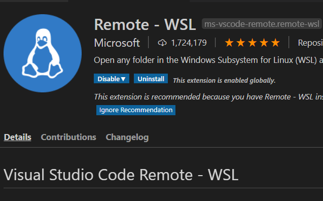
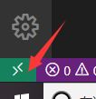
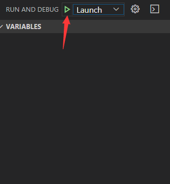
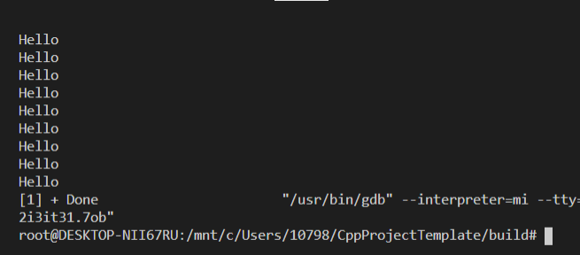
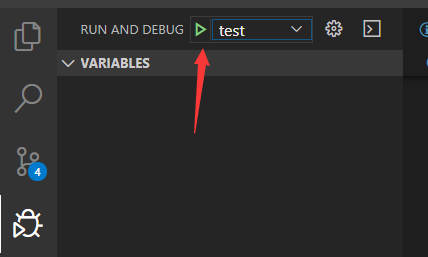
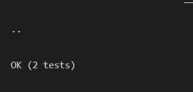

# VS Code + Cmake + CppUnit 搭建大型C++工程(一)(单元测试在第二篇添加)

本文介绍了以VS Code编辑器为核心, 用cmake编译, 配合gdb进行调试, cppunit进行单元测试(单元测试在第二篇添加)的大型C++工程最佳实践. (配置环境为WSL, Ubuntu和MacOS)  
本文所有源码可在[Github](https://github.com/1079805974/CppProjectTemplate)下载.
## 总工程概览
```text
Project:
│ 
├── bin                  可执行文件夹 
│   └── test             测试文件夹
├── build                cmake缓存目录 
├── include              头文件目录
│   └── utils.h
├── make                 bash脚本
├── readme.md            本文
├── src                  源文件目录
│   ├── main.cpp     
│   └── utils.cpp    
├── test                 单元测试目录
│   ├── CMakeLists.txt   子目录 CMakeLists
│   ├── main.cpp
│   ├── test.h
│   └── utils_test.cpp
└── CMakeLists.txt       主目录 CMakeLists
```

## 2020.2.14更新
感谢几位给我小星星的同学, 让我有动力完善下这个小框架.  
2020年, `VS Code`已经发生了巨大的变化, 编辑器市场无人能敌. `Code`更是推出了`Remote-DevTool`大大方便了远程编程, 我们也可以借助`Remote-DevTool`通过WSL进行编程.  
在windows上通过Pipe进行WSL编程显然已经落后了, 所以, 我删除了那一部分.   
现在可以在拓展商店搜索'Remote', 安装`Remote-WSL`:

然后点击左下角:  
  
就可以按照Ubuntu的操作照常进行了! 更多细节还等着你去发现哦~  

## 框架使用
准备步骤:
1. 使用git下载:
```
  git clone https://github.com/JingruiLea/CppProjectTemplate.git
```
2. 进入工程目录:
```
  cd CppProjectTemplate
```
3. 安装cmake, cppunit:
Ubuntu:
```
sudo apt-get install make cmake libcppunit-dev
```
MacOS:(MacOS 安装Cppunit请看末尾文章)
```
brew install make cmake
```
4. 完成!

使用步骤:
1. 运行文件  
点击此处:  

运行结果:

2. 测试文件  
点击此处:  
  
测试结果:  
  

具体文件解析请参考 <a target="_blank" href="https://zhuanlan.zhihu.com/p/45529097">VS Code + Cmake + CppUnit 搭建大型C++工程(二)</a>

感谢您的阅读. 欢迎点赞哦~